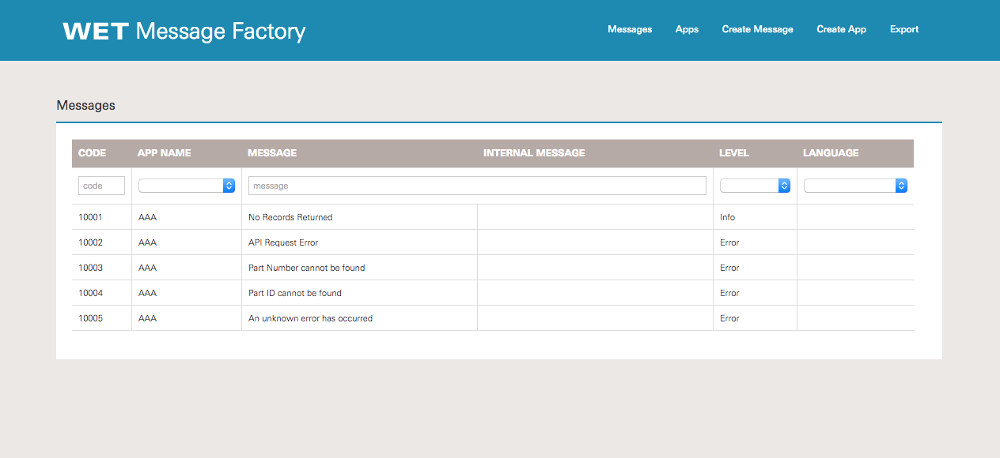

# message-factory

This is an Angular 1.x project that reads/displays and updates data. It uses some of the following features:
- angular-smart-table
- routing (angular-ui-router)
- services and factories
- example of configuration
- filters
- LESS
- bootstrap
- Grunt and npm/node and bower
- Karma for testing, karma-coverage for coverage reporting
- jshint
- angular-jsdoc

## Build & development

Run 'npm install'

Run 'bower install'

Run `grunt serve`

## Testing

Running `grunt test` will run the unit tests with karma.
